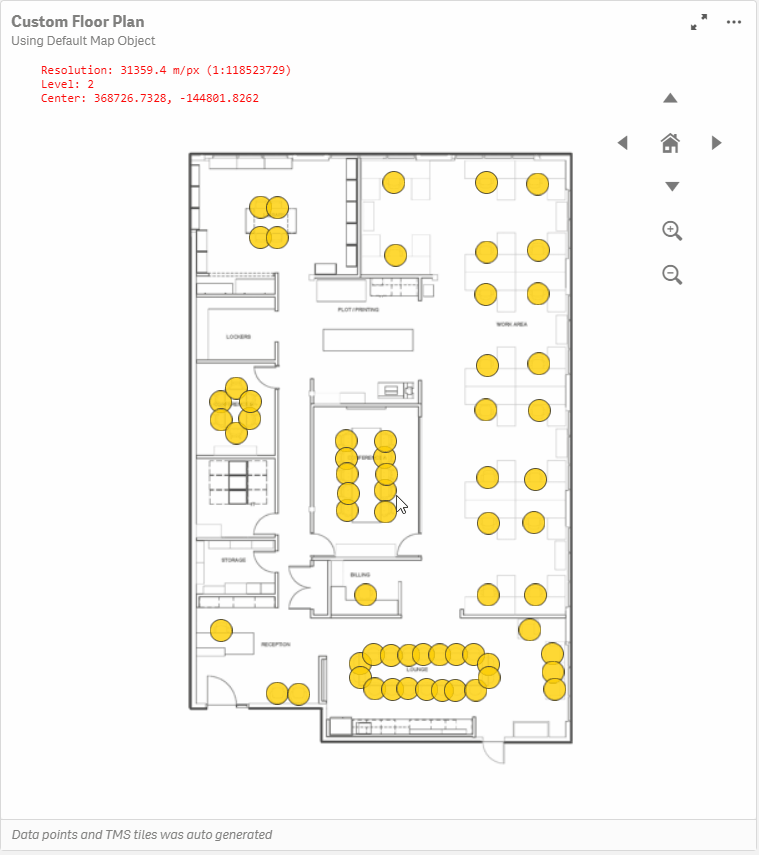
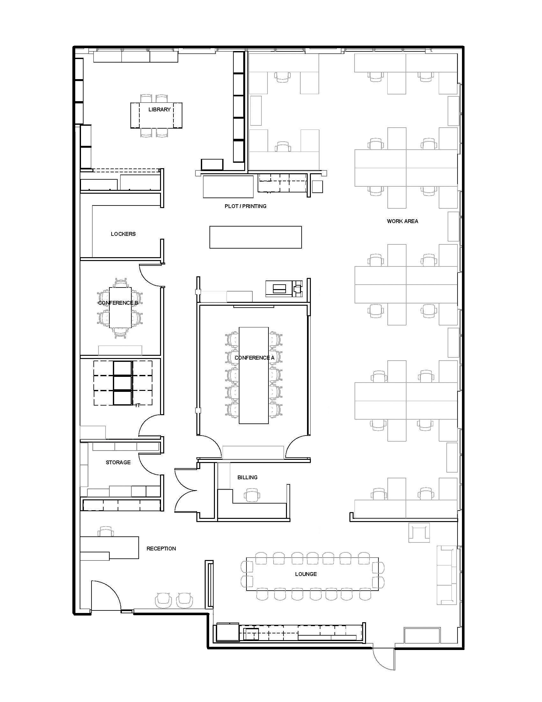
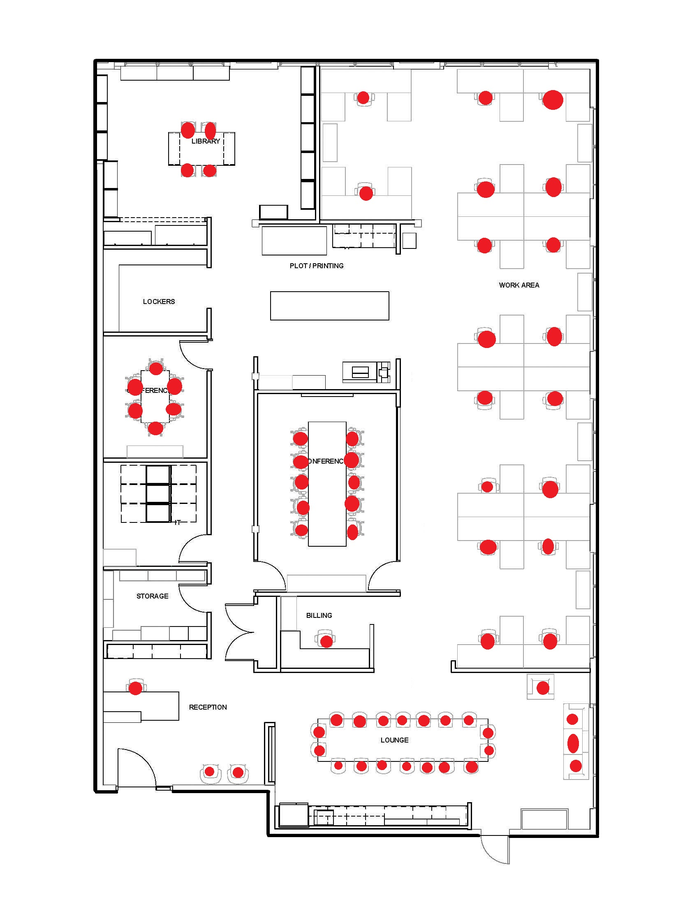
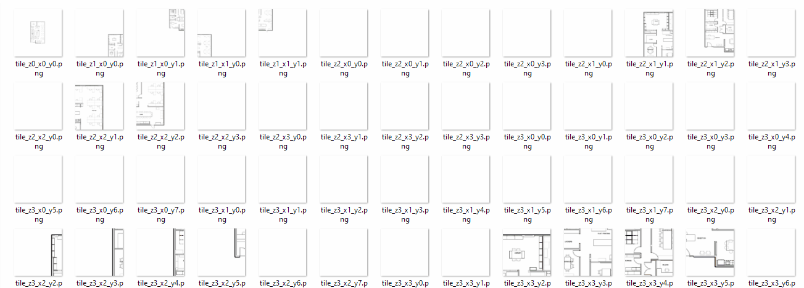

# qMaps
## About
Custom setup for Qlik Default Map.
Autogenerate tiles and LAT, LONG data.



## Input Samples
Custom map and a greyscale version with red marked points. 




## Output Samples

Generated Mask for LAT, LONG calculation
 

Generated files for TMS


Generated LAT, LONG
[CSV output](output.csv)

## Code Sample

Full code - [CustomTMS.py](CustomTMS.py)

## How to setup

* Update  file location and output folder path variables

```python
imgPath = './Floor_Plan.jpg'
pointImgPath = './Floor_Plan_marked.jpg'
outputFolder = './Output/'
```
* Change other control variables if required
```
zoom_limit = 4
tile_size = 256
bg_color = (255,255,255)

CONST_TOTAL = (40075016, -40075016)
CONST_ORIGIN = (-20037508, 20037508)
```

* Run the python script to generate Tiles and CSV data files.

* Past files under Documents\Qlik\Sense\Content\Default\TMS\FloorMap.

* In Qlik Sense Map backgroud layer. Select TMS and use url : ='http://localhost:4848/content/default/TMS/FloorMap/tile_z{z}_x{x}_y{y}.png'

* Load CSV data and Add LAT, LONG data.


