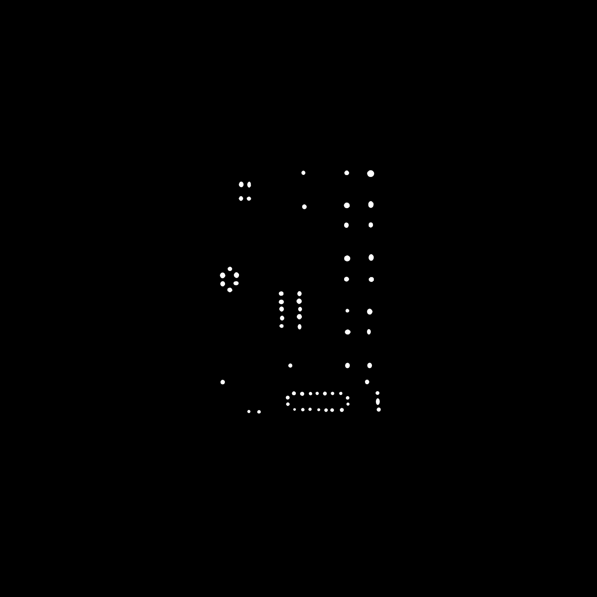

# QMap
## About
Custom setup for Qlik Default Map.
Autogenerate tiles and LAT, LONG data.


## Input Samples
Custom map and a greyscale version with red marked points. 


## Output Samples

Generated Mask for LAT, LONG calculation
 

Generated files for TMS


Generated LAT, LONG
[CSV output](output.csv)

## Code Sample

Full code - [QMapUtil.py](QMapUtil.py)

## How to setup

* Sample Code for QMapUtil Features 

```python
img_Path = './Floor_Plan.jpg'
img = QMapUtil.getImage(img_Path)
QMapUtil.generateMapTile(img, output_folder='./Output/', zoom_limit=4)

marked_img_Path = './Floor_Plan_marked.jpg'
marked_img = QMapUtil.getImage(marked_img_Path)
QMapUtil.extractGeoData(marked_img, save_mask=True)
```
* Change other control variables if required
```
    CONST_TOTAL = (40075016, -40075016)
    CONST_ORIGIN = (-20037508, 20037508)
    CONST_TILE_SIZE = 256
    CONST_BG_COLOR = (255, 255, 255)
```

* Run the python script to generate Tiles and CSV data files.

* Past files under Documents\Qlik\Sense\Content\Default\TMS\FloorMap.

* In Qlik Sense Map backgroud layer. Select TMS and use url : ='http://localhost:4848/content/default/TMS/FloorMap/tile_z{z}_x{x}_y{y}.png'

* Load Generated CSV and ADD LAT, LONG data.


